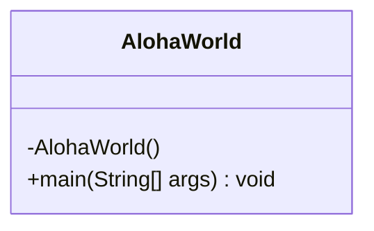

# Homework Aloha World Report

The following report contains questions you need to answer as part of your submission for the homework assignment. 


## Design Doc
Please link your UML design file here. See resources in the assignment on how to
link an image in markdown. You may also use [mermaid] class diagrams if you prefer, if so, include the mermaid code here.  You DO NOT have to include Greeting.java as part of the diagram, just the AlohaWorld application that includes: [AlohaWorld.java], [Greeter.java], and [ConsoleView.java].

1. **AlohaWorld** UML mermaid diagram:

2. **Greeter** UML mermaid diagram:
```mermaid
classDiagram
class Greeter {
   - name: String
   - locality: int
   
   +Greeter(name: String, locality: int)
   +greet(): Greeting
   +setLocality(locality: int): void
  }
  ```
3. **ConsoleView** UML mermaid diagram: 
```mermaid
classDiagram
class ConsoleView {
   - SCANNER: Scanner
   - LOCALITY_OPTIONS: LIST~String~
   
   - ConsoleView()
   - getName(): String
   + getLocality(): int
   + checkRunAgain(): boolean
   + printGreeting(greeting: String): void
  }
```


### Program Flow
Write a short paragraph detailing the flow of the program in your own words. This is to help you understand / trace the code (and give you practice of something called a code walk that will be required in this course).
> The beginning of the program starts by first going through the **AlohaWorld** file which is where `main()` is located, otherwise known as the starting point of the program. After the starting point, it begins by using the **ConsoleView** file to prompt the user for their name and where they are from. Then, it creates a greeting message from the **Greeter** file, which **ConsoleView** then uses to show on the screen to the user. After that, the program will then prompt the user again to ask if it wants to run it again. If the user answers yes, it will ask for another location, the greeting will change, and it will show a new message. If the user says no, then the program will end. 
## Assignment Questions

1. List three additional java syntax items you didn't know when reading the code.  (make sure to use * for the list items, see example below, the backtick marks are used to write code inline with markdown)
   
   * (example) `final class`
   > 1. `String.format(...)`
   > 2. `this(...)`
   > 3. `@Test`
2. For each syntax additional item listed above, explain what it does in your own words and then link a resource where you figured out what it does in the references section. 

    * (example) The `final` keyword when used on a class prevents the class from being subclassed. This means that the class cannot be extended by another class. This is useful when you want to prevent a class from being modified or extended[^1] . It is often the standard to do this when a class only contains static methods such as driver or utility classes. Math in Java is an example of a final class[^2] .

> i. The `String.format(...)` method is used to create a string by replacing placeholders like `%s` with actual values. Instead of joining strings using `+`, it allows you to control where values appear in the final string. In this assignment, it was used to insert the greeting and later the person’s name into formatted messages like `"Hello, %s!"`, which then became `"Hello, John!"` when the name was added [^1]
.
> 
> ii. The `this(...)` inside a constructor allows one constructor to call another constructor within the same class [^2]
. This helps reduce repeated code by keeping all initialization logic in one main constructor while simpler constructors pass default values, which makes the class easier to maintain and less error-prone [^2]
.
> 
> iii. The `@Test` annotation is used to mark a method as a test so that the testing framework automatically runs it instead of the programmer calling it manually [^3]
. This makes it possible to quickly verify that different parts of the program work correctly using assertions like `assertEquals`, which is especially helpful for catching bugs early in development [^3]
.
3. What does `main` do in Java? 

    > The `main` method in Java is the starting point of every program — it is where the Java Virtual Machine (JVM) begins executing code when the program runs. Without a properly defined `main` method, the program won’t start because the JVM looks specifically for this method signature (`public static void main(String[] args)`) to launch execution. In this assignment, the `main` method handled setting up variables and calling other methods to run the application, which is why it was necessary for the program to compile and run successfully[^4].


4. What does `toString()` do in Java? Why should any object class you create have a `toString()` method?

    > The `toString()` method in Java returns a string representation of an object so that its data can be displayed in a readable format instead of showing a memory reference[^5]. By default, Java’s version from the `Object` class is not very useful, so overriding it allows developers to show meaningful information about an object’s fields. Any object class should include a `toString()` method because it makes debugging, testing, and printing objects much clearer and easier to understand[^5].


5. What is javadoc style commenting? What is it used for? 

    > Javadoc-style commenting is a specific way of writing comments in Java that start with `/**` and end with `*/` so that tools like the Javadoc utility can automatically generate documentation from your source code[^6]. It is used to describe classes, methods, parameters, and return values in a structured format so that other developers (and documentation tools) can understand what your code does without reading the implementation. This makes it easier to share, maintain, and reference API details for your code[^6].


6. Describe Test Driving Development (TDD) in your own words. 

    > Test-Driven Development (TDD) is a software development approach where tests are written before writing the actual code that implements the functionality[^7]. The idea is to first define how the program should behave through failing tests, then write code to make those tests pass, and finally clean up the code through refactoring. This helps catch bugs early and ensures the program continues working correctly as changes are made[^7].


7. Go to the [Markdown Playground](MarkdownPlayground.md) and add at least 3 different markdown elements you learned about by reading the markdown resources listed in the document. Additionally you need to add a mermaid class diagram (of your choice does not have to follow the assignment. However, if you did use mermaid for the assignment, you can just copy that there). Add the elements into the markdown file, so that the formatting changes are reserved to that file. 


## Deeper Thinking Questions

These questions require deeper thinking of the topic. We don't expect 100% correct answers, but we encourage you to think deeply and come up with a reasonable answer. 


1. Why would we want to keep interaction with the client contained to ConsoleView?


2. Right now, the application isn't very dynamic in that it can be difficult to add new languages and greetings without modifying the code every time. Just thinking programmatically,  how could you make the application more dynamic? You are free to reference Geeting.java and how that could be used in your design.


> [!IMPORTANT]
>  After you upload the files to your github (ideally you have been committing throughout this progress / after you answer every question) - make sure to look at your completed assignment on github/in the browser! You can make sure images are showing up/formatting is correct, etc. The TAs will actually look at your assignment on github, so it is important that it is formatted correctly.


## References

[^1]: Final keyword in Java: 2024. https://www.geeksforgeeks.org/final-keyword-in-java/. Accessed: 2024-03-30. 

[^2]: Math (Java Platform SE 17). https://docs.oracle.com/en/java/javase/17/docs/api/java.base/java/lang/Math.html. Accessed: 2024-03-30.

>   [^1] String.format() Method in Java: 2024. https://www.w3schools.com/java/ref_string_format.asp
. Accessed: 2026-01-28. 
>
 >  [^2] Java this Keyword: 2024. https://www.w3schools.com/java/ref_keyword_this.asp
. Accessed: 2026-01-28. 
>
 >  [^3] Introduction to Testing in Java (JUnit): 2024. https://java-programming.mooc.fi/part-6/3-introduction-to-testing
. Accessed: 2026-01-28. 
>
 >  [^4] Java main method in Java: 2024. https://www.geeksforgeeks.org/java/java-main-method-public-static-void-main-string-args/
. Accessed: 2026-01-28.
> 
 > [^5] String toString() method in Java: 2024. https://www.geeksforgeeks.org/java/string-tostring-method-in-java/
. Accessed: 2026-01-28.
> 
 > [^6] What is Javadoc tool and how to use it: 2024. https://www.geeksforgeeks.org/java/what-is-javadoc-tool-and-how-to-use-it/.
Accessed: 2026-01-28.
>
 > [^7] Test-Driven Development (TDD): 2024. https://www.geeksforgeeks.org/software-engineering/test-driven-development-tdd/
. Accessed: 2026-01-28.

<!-- This is a comment, below this link the links in the document are placed here to make ti easier to read. This is an optional style for markdown, and often as a student you will include the links inline. for example [mermaid](https://mermaid.js.org/intro/syntax-reference.html) -->
[mermaid]: https://mermaid.js.org/intro/syntax-reference.html
[AlohaWorld.java]: src/main/java/student/AlohaWorld.java
[Greeter.java]: src/main/java/student/Greeter.java
[ConsoleView.java]: src/main/java/student/ConsoleView.java